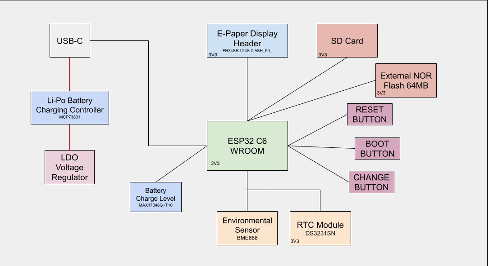

# OpenBook Project - TSC
### Similea Alin-Andrei 334CA

## Diagrama

## Descriere functionalitate hardware
Descrierea în detaliu a funcționalității hardware (ce module, componente, senzori, etc. ați folosit, prin ce interfețe se leagă la microcontroller-ul vostru, specificații de comunicație, procesare, calcule de consum de energie și orice altceva considerați relevant).

# Pini ESP32-C6
Descrieți în detaliu ce pini ai ESP32-C6 sunt folosiți pentru fiecare componentă și de ce.

## Rezolvare Erori/Warnings

Bobina L1 - "Copper Width error" - a trebuit sa modific dimensiunile pad-urilor din biblioteca data, deoarece nu erau conforme cu DRC-ul.

J2 - "Board Outline Clearance - Smd-Hole" - Am dat approve la warnings

U4 - "Smd, -Net Class: 1 POWER Top" - Modificam dimensiunea smd-urilor vizate la 32mil x 16mil

Pentru ca traseele de alimentare sa aiba width (0.3mm) diferit de celelalte (0.15mm) vom crea o regula custom folosind un net class separat pentru Copper Width.

Pentru a ne asigura ca evitam vias-urile la traseele de putere, vom face prima data rutarea acestora cu ajutorul liniei de comanda. (auto 3V3 EPD_3V3 EPD_3V3_C VBUS VUSB VBAT VRTC)

## Bill Of Materials

| Schematic name | Value | Component | Footprint Name | 3D Component | Datasheet |
|----------------|----------|----------------|----------------|----------------|----------------|		
|	BOOT_BUTTON	|	BUTTON_CUSYOMV1	|	BUTTON_CUSYOMV1	|	MYBUTTON	|	https://industry.panasonic.com/global/en/products/control/switch/light-touch/number/evqpuj02k	|	https://industry.panasonic.com/global/en/downloads?tab=catalog&small_g_cd=203&part_no=EVQPUJ02K	|
|	C1	|	100nF	|	ESP32_WROVER_EAGLE-LTSPICE_CC0402	|	ESP32_WROVER_EAGLE-LTSPICE_C0402	|	https://componentsearchengine.com/part-view/CC0402MRX5R5BB106/YAGEO	|	https://componentsearchengine.com/Datasheets/2/CC0402MRX5R5BB106.pdf	|
|	C1_BAT	|	4.7uF	|	ESP32_WROVER_EAGLE-LTSPICE_CC0402	|	ESP32_WROVER_EAGLE-LTSPICE_C0402	|	https://componentsearchengine.com/part-view/CC0402MRX5R5BB106/YAGEO	|	https://componentsearchengine.com/Datasheets/2/CC0402MRX5R5BB106.pdf	|
|	C1_BAT1	|	4.7uF	|	EAGLE-LTSPICE_CC0402	|	EAGLE-LTSPICE_C0402	|	https://www.snapeda.com/parts/CC0402DRNPO9BN5R1/Yageo/view-part/?ref=dk&t=LTSPICE_CC0402&con_ref=None	|	https://s3.amazonaws.com/snapeda/datasheet/CC0402DRNPO9BN5R1_Yageo.pdf	|
|	C2_BAT1	|	4.7uF	|	EAGLE-LTSPICE_CC0402	|	EAGLE-LTSPICE_C0402	|	https://www.snapeda.com/parts/CC0402DRNPO9BN5R1/Yageo/view-part/?ref=dk&t=LTSPICE_CC0402&con_ref=None	|	https://s3.amazonaws.com/snapeda/datasheet/CC0402DRNPO9BN5R1_Yageo.pdf	|
|	C1_BAT2	|	4.7uF	|	EAGLE-LTSPICE_CC0402	|	EAGLE-LTSPICE_C0402	|	https://www.snapeda.com/parts/CC0402DRNPO9BN5R1/Yageo/view-part/?ref=dk&t=LTSPICE_CC0402&con_ref=None	|	https://s3.amazonaws.com/snapeda/datasheet/CC0402DRNPO9BN5R1_Yageo.pdf	|
|	C2	|	100nF	|	ESP32_WROVER_EAGLE-LTSPICE_CC0402	|	ESP32_WROVER_EAGLE-LTSPICE_C0402	|	https://componentsearchengine.com/part-view/CC0402MRX5R5BB106/YAGEO	|	https://componentsearchengine.com/Datasheets/2/CC0402MRX5R5BB106.pdf	|
|	C2_BAT	|	4.7uF	|	ESP32_WROVER_EAGLE-LTSPICE_CC0402	|	ESP32_WROVER_EAGLE-LTSPICE_C0402	|	https://componentsearchengine.com/part-view/CC0402MRX5R5BB106/YAGEO	|	https://componentsearchengine.com/Datasheets/2/CC0402MRX5R5BB106.pdf	|
|	C3	|	100uF TANT	|	RCL_CPOL-EUCT3528	|	RCL_CT3528	|	https://www.snapeda.com/parts/TAJB475K025RNJ/AVX/view-part/?ref=dk&t=capacitor%203528&con_ref=None	|	https://s3.amazonaws.com/snapeda/datasheet/TAJB475K025RNJ_AVX.pdf	|
|	C4	|	4.7uF/25V	|	ESP32_WROVER_EAGLE-LTSPICE_CC0402	|	ESP32_WROVER_EAGLE-LTSPICE_C0402	|	https://componentsearchengine.com/part-view/CC0402MRX5R5BB106/YAGEO	|	https://componentsearchengine.com/Datasheets/2/CC0402MRX5R5BB106.pdf	|
|	C4_USB	|	100nF	|	ESP32_WROVER_EAGLE-LTSPICE_CC0402	|	ESP32_WROVER_EAGLE-LTSPICE_C0402	|	https://componentsearchengine.com/part-view/CC0402MRX5R5BB106/YAGEO	|	https://componentsearchengine.com/Datasheets/2/CC0402MRX5R5BB106.pdf	|
|	C5	|	1uF	|	ESP32_WROVER_EAGLE-LTSPICE_CC0402	|	ESP32_WROVER_EAGLE-LTSPICE_C0402	|	https://componentsearchengine.com/part-view/CC0402MRX5R5BB106/YAGEO	|	https://componentsearchengine.com/Datasheets/2/CC0402MRX5R5BB106.pdf	|
|	C5_USB	|	4.7uF	|	ESP32_WROVER_EAGLE-LTSPICE_CC0402	|	ESP32_WROVER_EAGLE-LTSPICE_C0402	|	https://componentsearchengine.com/part-view/CC0402MRX5R5BB106/YAGEO	|	https://componentsearchengine.com/Datasheets/2/CC0402MRX5R5BB106.pdf	|
|	C6	|	100nF	|	ESP32_WROVER_EAGLE-LTSPICE_CC0402	|	ESP32_WROVER_EAGLE-LTSPICE_C0402	|	https://componentsearchengine.com/part-view/CC0402MRX5R5BB106/YAGEO	|	https://componentsearchengine.com/Datasheets/2/CC0402MRX5R5BB106.pdf	|
|	C7	|	10uF	|	ESP32_WROVER_EAGLE-LTSPICE_CC0402	|	ESP32_WROVER_EAGLE-LTSPICE_C0402	|	https://componentsearchengine.com/part-view/CC0402MRX5R5BB106/YAGEO	|	https://componentsearchengine.com/Datasheets/2/CC0402MRX5R5BB106.pdf	|
|	C8	|	100nF	|	ESP32_WROVER_EAGLE-LTSPICE_CC0402	|	ESP32_WROVER_EAGLE-LTSPICE_C0402	|	https://componentsearchengine.com/part-view/CC0402MRX5R5BB106/YAGEO	|	https://componentsearchengine.com/Datasheets/2/CC0402MRX5R5BB106.pdf	|
|	C9	|	100nF	|	EAGLE-LTSPICE_CC0402	|	EAGLE-LTSPICE_C0402	|	https://www.snapeda.com/parts/CC0402DRNPO9BN5R1/Yageo/view-part/?ref=dk&t=LTSPICE_CC0402&con_ref=None	|	https://s3.amazonaws.com/snapeda/datasheet/CC0402DRNPO9BN5R1_Yageo.pdf	|
|	C10	|	100nF	|	ESP32_WROVER_EAGLE-LTSPICE_CC0402	|	ESP32_WROVER_EAGLE-LTSPICE_C0402	|	https://componentsearchengine.com/part-view/CC0402MRX5R5BB106/YAGEO	|	https://componentsearchengine.com/Datasheets/2/CC0402MRX5R5BB106.pdf	|
|	C10_SUPERCAP	|	CPH3225A	|	CPH3225A	|	CAPCP3225X100N	|	https://www.snapeda.com/parts/CPH3225A/Seiko+Instruments/view-part/?ref=eda	|	https://www.snapeda.com/parts/CPH3225A/Seiko%20Instruments/datasheet/	|
|	CHANGE_BUTTON	|	BUTTON_CUSYOMV1	|	BUTTON_CUSYOMV1	|	MYBUTTON	|	https://industry.panasonic.com/global/en/products/control/switch/light-touch/number/evqpuj02k	|	https://industry.panasonic.com/global/en/downloads?tab=catalog&small_g_cd=203&part_no=EVQPUJ02K	|
|	CHG_LED	|		|	ADAFRUIT_LEDCHIP-LED0603	|	ADAFRUIT_CHIP-LED0603	|	https://www.snapeda.com/parts/KP-1608SURCK/Kingbright/view-part/?ref=search&t=LED%200603	|	https://www.snapeda.com/parts/KP-1608SURCK/Kingbright/datasheet/	|
|	C_DELAY	|	100nF	|	ESP32_WROVER_EAGLE-LTSPICE_CC0402	|	ESP32_WROVER_EAGLE-LTSPICE_C0402	|	https://componentsearchengine.com/part-view/CC0402MRX5R5BB106/YAGEO	|	https://componentsearchengine.com/Datasheets/2/CC0402MRX5R5BB106.pdf	|
|	D1	|	USBLC6-2SC6Y	|	USBLC6-2SC6Y	|	SOT95P280X145-6N	|	https://www.snapeda.com/parts/USBLC6-2SC6Y/STMicroelectronics/view-part/?ref=snap	|	https://www.snapeda.com/parts/USBLC6-2SC6Y/STMicroelectronics/datasheet/	|
|	D2	|	ESP32_WROVER_AVX---SD0805S020S1R0_AVX_SD0805S020S1R0_0_0AVX_SD0805S020S1R0_0_0	|	ESP32_WROVER_AVX---SD0805S020S1R0_AVX_SD0805S020S1R0_0_0AVX_SD0805S020S1R0_0_0	|	ESP32_WROVER_AVX---SD0805S020S1R0_AVX_SD0805S020S1R0_0	|	https://ro.mouser.com/ProductDetail/KYOCERA-AVX/SD0805S020S1R0?qs=jCA%252BPfw4LHbpkAoSnwrdjw%3D%3D	|	http://datasheets.avx.com/schottky.pdf	|
|	D3	|	MBR0530	|	MBR0530	|	SOD3716X135N	|	https://www.snapeda.com/parts/MBR0530/Onsemi/view-part/?ref=eda	|	https://www.snapeda.com/parts/MBR0530/ON%20Semiconductor/datasheet/	|
|	D4	|	MBR0530	|	MBR0530	|	SOD3716X135N	|	https://www.snapeda.com/parts/MBR0530/Onsemi/view-part/?ref=eda	|	https://www.snapeda.com/parts/MBR0530/ON%20Semiconductor/datasheet/	|
|	D5	|	MBR0530	|	MBR0530	|	SOD3716X135N	|	https://www.snapeda.com/parts/MBR0530/Onsemi/view-part/?ref=eda	|	https://www.snapeda.com/parts/MBR0530/ON%20Semiconductor/datasheet/	|
|	D6	|	PGB1010603MR	|	PGB1010603MR	|	DIOC1608X36N	|	https://www.snapeda.com/parts/PGB1010603MR/Littelfuse/view-part/?ref=eda	|	https://www.snapeda.com/parts/PGB1010603MR/Littelfuse%20Inc./datasheet/	|
|	D7	|	ESP32_WROVER_AVX---SD0805S020S1R0_AVX_SD0805S020S1R0_0_0AVX_SD0805S020S1R0_0_0	|	ESP32_WROVER_AVX---SD0805S020S1R0_AVX_SD0805S020S1R0_0_0AVX_SD0805S020S1R0_0_0	|	ESP32_WROVER_AVX---SD0805S020S1R0_AVX_SD0805S020S1R0_0	|	https://eu.mouser.com/ProductDetail/KYOCERA-AVX/SD0805S020S1R0?qs=jCA%252BPfw4LHbpkAoSnwrdjw%3D%3D	|	http://datasheets.avx.com/schottky.pdf	|
|	D8	|	PGB1010603MR	|	PGB1010603MR	|	DIOC1608X36N	|	https://www.snapeda.com/parts/PGB1010603MR/Littelfuse/view-part/?ref=eda	|	https://www.snapeda.com/parts/PGB1010603MR/Littelfuse%20Inc./datasheet/	|
|	D9	|	PGB1010603MR	|	PGB1010603MR	|	DIOC1608X36N	|	https://www.snapeda.com/parts/PGB1010603MR/Littelfuse/view-part/?ref=eda	|	https://www.snapeda.com/parts/PGB1010603MR/Littelfuse%20Inc./datasheet/	|
|	D10	|	PGB1010603MR	|	PGB1010603MR	|	DIOC1608X36N	|	https://www.snapeda.com/parts/PGB1010603MR/Littelfuse/view-part/?ref=eda	|	https://www.snapeda.com/parts/PGB1010603MR/Littelfuse%20Inc./datasheet/	|
|	D11	|	PGB1010603MR	|	PGB1010603MR	|	DIOC1608X36N	|	https://www.snapeda.com/parts/PGB1010603MR/Littelfuse/view-part/?ref=eda	|	https://www.snapeda.com/parts/PGB1010603MR/Littelfuse%20Inc./datasheet/	|
|	D12	|	PGB1010603MR	|	PGB1010603MR	|	DIOC1608X36N	|	https://www.snapeda.com/parts/PGB1010603MR/Littelfuse/view-part/?ref=eda	|	https://www.snapeda.com/parts/PGB1010603MR/Littelfuse%20Inc./datasheet/	|
|	EPD_C1	|	1uF/50V	|	ESP32_WROVER_EAGLE-LTSPICE_CC0402	|	ESP32_WROVER_EAGLE-LTSPICE_C0402	|	https://componentsearchengine.com/part-view/CC0402MRX5R5BB106/YAGEO	|	https://componentsearchengine.com/Datasheets/2/CC0402MRX5R5BB106.pdf	|
|	EPD_C2	|	1uF/50V	|	ESP32_WROVER_EAGLE-LTSPICE_CC0402	|	ESP32_WROVER_EAGLE-LTSPICE_C0402	|	https://componentsearchengine.com/part-view/CC0402MRX5R5BB106/YAGEO	|	https://componentsearchengine.com/Datasheets/2/CC0402MRX5R5BB106.pdf	|
|	EPD_C5	|	1uF/50V	|	ESP32_WROVER_EAGLE-LTSPICE_CC0402	|	ESP32_WROVER_EAGLE-LTSPICE_C0402	|	https://componentsearchengine.com/part-view/CC0402MRX5R5BB106/YAGEO	|	https://componentsearchengine.com/Datasheets/2/CC0402MRX5R5BB106.pdf	|
|	EPD_C6	|	1uF/50V	|	ESP32_WROVER_EAGLE-LTSPICE_CC0402	|	ESP32_WROVER_EAGLE-LTSPICE_C0402	|	https://componentsearchengine.com/part-view/CC0402MRX5R5BB106/YAGEO	|	https://componentsearchengine.com/Datasheets/2/CC0402MRX5R5BB106.pdf	|
|	EPD_C7	|	1uF/50V	|	ESP32_WROVER_EAGLE-LTSPICE_CC0402	|	ESP32_WROVER_EAGLE-LTSPICE_C0402	|	https://componentsearchengine.com/part-view/CC0402MRX5R5BB106/YAGEO	|	https://componentsearchengine.com/Datasheets/2/CC0402MRX5R5BB106.pdf	|
|	EPD_C8	|	1uF/50V	|	ESP32_WROVER_EAGLE-LTSPICE_CC0402	|	ESP32_WROVER_EAGLE-LTSPICE_C0402	|	https://componentsearchengine.com/part-view/CC0402MRX5R5BB106/YAGEO	|	https://componentsearchengine.com/Datasheets/2/CC0402MRX5R5BB106.pdf	|
|	EPD_C9	|	1uF/50V	|	ESP32_WROVER_EAGLE-LTSPICE_CC0402	|	ESP32_WROVER_EAGLE-LTSPICE_C0402	|	https://componentsearchengine.com/part-view/CC0402MRX5R5BB106/YAGEO	|	https://componentsearchengine.com/Datasheets/2/CC0402MRX5R5BB106.pdf	|
|	EPD_C10	|	1uF/50V	|	ESP32_WROVER_EAGLE-LTSPICE_CC0402	|	ESP32_WROVER_EAGLE-LTSPICE_C0402	|	https://componentsearchengine.com/part-view/CC0402MRX5R5BB106/YAGEO	|	https://componentsearchengine.com/Datasheets/2/CC0402MRX5R5BB106.pdf	|
|	EPD_C11	|	1uF/50V	|	ESP32_WROVER_EAGLE-LTSPICE_CC0402	|	ESP32_WROVER_EAGLE-LTSPICE_C0402	|	https://componentsearchengine.com/part-view/CC0402MRX5R5BB106/YAGEO	|	https://componentsearchengine.com/Datasheets/2/CC0402MRX5R5BB106.pdf	|
|	EPD_C12	|	1uF/50V	|	ESP32_WROVER_EAGLE-LTSPICE_CC0402	|	ESP32_WROVER_EAGLE-LTSPICE_C0402	|	https://componentsearchengine.com/part-view/CC0402MRX5R5BB106/YAGEO	|	https://componentsearchengine.com/Datasheets/2/CC0402MRX5R5BB106.pdf	|
|	IC1	|	BD5229G-TR	|	BD5229G-TR	|	SOT95P280X125-5N	|	https://componentsearchengine.com/part-view/BD5229G-TR/ROHM%20Semiconductor	|	https://datasheet.datasheetarchive.com/originals/distributors/Datasheets_SAMA/f2b9741ef86007909f138d561a359946.pdf	|
|	IC4	|	XC6220A331MR-G	|	XC6220A331MR-G	|	SOT95P280X120-5N	|	https://componentsearchengine.com/part-view/XC6220A331MR-G/Torex	|	https://product.torexsemi.com/system/files/series/xc6220.pdf	|
|	J1	|	FH34SRJ-24S-0.5SH_99_	|	FH34SRJ-24S-0.5SH_99_	|	FH34SRJ24S05SH99	|	https://componentsearchengine.com/part-view/FH34SRJ-24S-0.5SH(99)/Hirose	|	https://www.hirose.com/en/product/document?clcode=CL0580-1255-6-99&productname=FH34SRJ-24S-0.5SH(99)&series=FH34SRJ&documenttype=2DDrawing&lang=en&documentid=0000990903	|
|	J2	|	SAMACSYS_PARTS_USB4110-GF-A	|	SAMACSYS_PARTS_USB4110-GF-A	|	SAMACSYS_PARTS_USB4110GFA	|	https://componentsearchengine.com/part-view/USB4110-GF-A/GCT%20(GLOBAL%20CONNECTOR%20TECHNOLOGY)	|	https://gct.co/files/drawings/usb4110.pdf	|
|	J3	|	QWIIC_RIGHT_ANGLE	|	QWIIC_CONNECTORJS-1MM	|	JST04_1MM_RA	|	https://grabcad.com/library/sparkfun-qwiic-right-angle-1	|	4208 Adafruit | Mouser	|
|	J4	|	112A-TAAR-R03_ATTEND	|	112A-TAAR-R03_ATTEND	|	112ATAARR03ATTEND	|	https://store.comet.srl.ro/Catalogue/Product/43497/	|	https://store.comet.srl.ro/Catalogue/Product/43497/	|
|	L1	|	68uH	|	744043680IND_4828-WE-TPC_WRE	|	IND_4828-WE-TPC_WRE	|	https://ro.mouser.com/ProductDetail/Wurth-Elektronik/744043680?qs=PGXP4M47uW6VkZq%252BkzjrHA%3D%3D	|	https://www.we-online.com/components/products/datasheet/744043680.pdf	|
|	PFMF.050.1	|	ESP32C6_VARISTORCN1812	|	ESP32C6_VARISTORCN1812	|	ESP32C6_VARISTOR_CT/CN1812	|	https://www.mouser.co.uk/ProductDetail/EPCOS-TDK/B72520T0350K062?qs=dEfas%2FXlABIszF52uu7vrg%3D%3D	|	https://www.mouser.co.uk/ProductDetail/EPCOS-TDK/B72520T0350K062?qs=dEfas%2FXlABIszF52uu7vrg%3D%3D	|
|	Q1	|	20V/4.2A/52mO/1.4W	|	ESP32_WROVER_SPARKFUN-DISCRETESEMI_MOSFET_PCH-DMG2305UX-7	|	ESP32_WROVER_SPARKFUN-DISCRETESEMI_SOT23-3	|	https://componentsearchengine.com/part-view/DMG2305UX-7/Diodes%20Incorporated	|	https://www.diodes.com//assets/Datasheets/DMG2305UX.pdf	|
|	Q2	|	20V/4.2A/52mO/1.4W	|	ESP32_WROVER_SPARKFUN-DISCRETESEMI_MOSFET_PCH-DMG2305UX-7	|	ESP32_WROVER_SPARKFUN-DISCRETESEMI_SOT23-3	|	https://componentsearchengine.com/part-view/DMG2305UX-7/Diodes%20Incorporated	|	https://www.diodes.com//assets/Datasheets/DMG2305UX.pdf	|
|	Q3	|	SI1308EDL-T1-GE3	|	D8	|	SOT65P210X110-3N	|	https://componentsearchengine.com/part-view/SI1308EDL-T1-GE3/Vishay	|	https://componentsearchengine.com/Datasheets/1/SI1308EDL-T1-GE3.pdf	|
|	R1	|	10K	|	ESP32_WROVER_EAGLE-LTSPICE_RR0402	|	ESP32_WROVER_EAGLE-LTSPICE_R0402	|	https://componentsearchengine.com/part-view/R0402%201%25%20100%20K%20(RC0402FR-07100KL)/YAGEO	|	https://www.yageo.com/upload/media/product/products/datasheet/rchip/PYu-RC_Group_51_RoHS_L_12.pdf	|
|	R1-PINH	|	10K	|	ESP32_WROVER_EAGLE-LTSPICE_RR0402	|	ESP32_WROVER_EAGLE-LTSPICE_R0402	|	https://componentsearchengine.com/part-view/R0402%201%25%20100%20K%20(RC0402FR-07100KL)/YAGEO	|	https://www.yageo.com/upload/media/product/products/datasheet/rchip/PYu-RC_Group_51_RoHS_L_12.pdf	|
|	R1-PINH1	|	10K	|	ESP32_WROVER_EAGLE-LTSPICE_RR0402	|	ESP32_WROVER_EAGLE-LTSPICE_R0402	|	https://componentsearchengine.com/part-view/R0402%201%25%20100%20K%20(RC0402FR-07100KL)/YAGEO	|	https://www.yageo.com/upload/media/product/products/datasheet/rchip/PYu-RC_Group_51_RoHS_L_12.pdf	|
|	R1_BAT	|	200	|	ESP32_WROVER_EAGLE-LTSPICE_RR0402	|	ESP32_WROVER_EAGLE-LTSPICE_R0402	|	https://componentsearchengine.com/part-view/R0402%201%25%20100%20K%20(RC0402FR-07100KL)/YAGEO	|	https://www.yageo.com/upload/media/product/products/datasheet/rchip/PYu-RC_Group_51_RoHS_L_12.pdf	|
|	R1_PWRUSB	|	100K	|	ESP32_WROVER_EAGLE-LTSPICE_RR0402	|	ESP32_WROVER_EAGLE-LTSPICE_R0402	|	https://componentsearchengine.com/part-view/R0402%201%25%20100%20K%20(RC0402FR-07100KL)/YAGEO	|	https://www.yageo.com/upload/media/product/products/datasheet/rchip/PYu-RC_Group_51_RoHS_L_12.pdf	|
|	R2	|	2.2	|	ESP32_WROVER_EAGLE-LTSPICE_RR0402	|	ESP32_WROVER_EAGLE-LTSPICE_R0402	|	https://componentsearchengine.com/part-view/R0402%201%25%20100%20K%20(RC0402FR-07100KL)/YAGEO	|	https://www.yageo.com/upload/media/product/products/datasheet/rchip/PYu-RC_Group_51_RoHS_L_12.pdf	|
|	R2-PINH	|	10K	|	ESP32_WROVER_EAGLE-LTSPICE_RR0402	|	ESP32_WROVER_EAGLE-LTSPICE_R0402	|	https://componentsearchengine.com/part-view/R0402%201%25%20100%20K%20(RC0402FR-07100KL)/YAGEO	|	https://www.yageo.com/upload/media/product/products/datasheet/rchip/PYu-RC_Group_51_RoHS_L_12.pdf	|
|	R2-PINH1	|	10K	|	ESP32_WROVER_EAGLE-LTSPICE_RR0402	|	ESP32_WROVER_EAGLE-LTSPICE_R0402	|	https://componentsearchengine.com/part-view/R0402%201%25%20100%20K%20(RC0402FR-07100KL)/YAGEO	|	https://www.yageo.com/upload/media/product/products/datasheet/rchip/PYu-RC_Group_51_RoHS_L_12.pdf	|
|	R2-USB	|	5k1	|	ESP32_WROVER_EAGLE-LTSPICE_RR0402	|	ESP32_WROVER_EAGLE-LTSPICE_R0402	|	https://componentsearchengine.com/part-view/R0402%201%25%20100%20K%20(RC0402FR-07100KL)/YAGEO	|	https://www.yageo.com/upload/media/product/products/datasheet/rchip/PYu-RC_Group_51_RoHS_L_12.pdf	|
|	R2-USB1	|	5k1	|	ESP32_WROVER_EAGLE-LTSPICE_RR0402	|	ESP32_WROVER_EAGLE-LTSPICE_R0402	|	https://componentsearchengine.com/part-view/R0402%201%25%20100%20K%20(RC0402FR-07100KL)/YAGEO	|	https://www.yageo.com/upload/media/product/products/datasheet/rchip/PYu-RC_Group_51_RoHS_L_12.pdf	|
|	R2_BAT	|	2K	|	ESP32_WROVER_EAGLE-LTSPICE_RR0402	|	ESP32_WROVER_EAGLE-LTSPICE_R0402	|	https://componentsearchengine.com/part-view/R0402%201%25%20100%20K%20(RC0402FR-07100KL)/YAGEO	|	https://www.yageo.com/upload/media/product/products/datasheet/rchip/PYu-RC_Group_51_RoHS_L_12.pdf	|
|	R3	|	10K	|	ESP32_WROVER_EAGLE-LTSPICE_RR0402	|	ESP32_WROVER_EAGLE-LTSPICE_R0402	|	https://componentsearchengine.com/part-view/R0402%201%25%20100%20K%20(RC0402FR-07100KL)/YAGEO	|	https://www.yageo.com/upload/media/product/products/datasheet/rchip/PYu-RC_Group_51_RoHS_L_12.pdf	|
|	R4	|	10K	|	ESP32_WROVER_EAGLE-LTSPICE_RR0402	|	ESP32_WROVER_EAGLE-LTSPICE_R0402	|	https://componentsearchengine.com/part-view/R0402%201%25%20100%20K%20(RC0402FR-07100KL)/YAGEO	|	https://www.yageo.com/upload/media/product/products/datasheet/rchip/PYu-RC_Group_51_RoHS_L_12.pdf	|
|	R5	|	10K	|	ESP32_WROVER_EAGLE-LTSPICE_RR0402	|	ESP32_WROVER_EAGLE-LTSPICE_R0402	|	https://componentsearchengine.com/part-view/R0402%201%25%20100%20K%20(RC0402FR-07100KL)/YAGEO	|	https://www.yageo.com/upload/media/product/products/datasheet/rchip/PYu-RC_Group_51_RoHS_L_12.pdf	|
|	R6	|	10K	|	ESP32_WROVER_EAGLE-LTSPICE_RR0402	|	ESP32_WROVER_EAGLE-LTSPICE_R0402	|	https://componentsearchengine.com/part-view/R0402%201%25%20100%20K%20(RC0402FR-07100KL)/YAGEO	|	https://www.yageo.com/upload/media/product/products/datasheet/rchip/PYu-RC_Group_51_RoHS_L_12.pdf	|
|	R7	|	10K	|	ESP32_WROVER_EAGLE-LTSPICE_RR0402	|	ESP32_WROVER_EAGLE-LTSPICE_R0402	|	https://componentsearchengine.com/part-view/R0402%201%25%20100%20K%20(RC0402FR-07100KL)/YAGEO	|	https://www.yageo.com/upload/media/product/products/datasheet/rchip/PYu-RC_Group_51_RoHS_L_12.pdf	|
|	R8	|	10K	|	ESP32_WROVER_EAGLE-LTSPICE_RR0402	|	ESP32_WROVER_EAGLE-LTSPICE_R0402	|	https://componentsearchengine.com/part-view/R0402%201%25%20100%20K%20(RC0402FR-07100KL)/YAGEO	|	https://www.yageo.com/upload/media/product/products/datasheet/rchip/PYu-RC_Group_51_RoHS_L_12.pdf	|
|	R9	|	10K	|	ESP32_WROVER_EAGLE-LTSPICE_RR0402	|	ESP32_WROVER_EAGLE-LTSPICE_R0402	|	https://componentsearchengine.com/part-view/R0402%201%25%20100%20K%20(RC0402FR-07100KL)/YAGEO	|	https://www.yageo.com/upload/media/product/products/datasheet/rchip/PYu-RC_Group_51_RoHS_L_12.pdf	|
|	R10	|	10K	|	ESP32_WROVER_EAGLE-LTSPICE_RR0402	|	ESP32_WROVER_EAGLE-LTSPICE_R0402	|	https://componentsearchengine.com/part-view/R0402%201%25%20100%20K%20(RC0402FR-07100KL)/YAGEO	|	https://www.yageo.com/upload/media/product/products/datasheet/rchip/PYu-RC_Group_51_RoHS_L_12.pdf	|
|	RESET_BUTTON	|	BUTTON_CUSYOMV1	|	BUTTON_CUSYOMV1	|	MYBUTTON	|	https://industry.panasonic.com/global/en/products/control/switch/light-touch/number/evqpuj02k	|	https://industry.panasonic.com/global/en/downloads?tab=catalog&small_g_cd=203&part_no=EVQPUJ02K	|
|	R_BOOT	|	10K	|	ESP32_WROVER_EAGLE-LTSPICE_RR0402	|	ESP32_WROVER_EAGLE-LTSPICE_R0402	|	https://componentsearchengine.com/part-view/R0402%201%25%20100%20K%20(RC0402FR-07100KL)/YAGEO	|	https://www.yageo.com/upload/media/product/products/datasheet/rchip/PYu-RC_Group_51_RoHS_L_12.pdf	|
|	R_CAPACITOR	|	15	|	ESP32_WROVER_EAGLE-LTSPICE_RR0402	|	ESP32_WROVER_EAGLE-LTSPICE_R0402	|	https://componentsearchengine.com/part-view/R0402%201%25%20100%20K%20(RC0402FR-07100KL)/YAGEO	|	https://www.yageo.com/upload/media/product/products/datasheet/rchip/PYu-RC_Group_51_RoHS_L_12.pdf	|
|	R_CHANGE	|	10K	|	ESP32_WROVER_EAGLE-LTSPICE_RR0402	|	ESP32_WROVER_EAGLE-LTSPICE_R0402	|	https://componentsearchengine.com/part-view/R0402%201%25%20100%20K%20(RC0402FR-07100KL)/YAGEO	|	https://www.yageo.com/upload/media/product/products/datasheet/rchip/PYu-RC_Group_51_RoHS_L_12.pdf	|
|	R_CL1	|	10K	|	ESP32_WROVER_EAGLE-LTSPICE_RR0402	|	ESP32_WROVER_EAGLE-LTSPICE_R0402	|	https://componentsearchengine.com/part-view/R0402%201%25%20100%20K%20(RC0402FR-07100KL)/YAGEO	|	https://www.yageo.com/upload/media/product/products/datasheet/rchip/PYu-RC_Group_51_RoHS_L_12.pdf	|
|	R_RESET	|	10K	|	ESP32_WROVER_EAGLE-LTSPICE_RR0402	|	ESP32_WROVER_EAGLE-LTSPICE_R0402	|	https://componentsearchengine.com/part-view/R0402%201%25%20100%20K%20(RC0402FR-07100KL)/YAGEO	|	https://www.yageo.com/upload/media/product/products/datasheet/rchip/PYu-RC_Group_51_RoHS_L_12.pdf	|
|	SENSOR2	|	ESP32_WROVER_BME680_BME680	|	ESP32_WROVER_BME680_BME680	|	ESP32_WROVER_BME680_PSON80P300X300X100-8N	|	https://www.snapeda.com/parts/BME680/Bosch/view-part/?welcome=home	|	https://www.snapeda.com/parts/BME680/Bosch%20Sensortec/datasheet/	|
|	SJ1	|	SJ	|	SJ	|	SJ	|	https://grabcad.com/library/solder-jumpers-1	|	https://www.digikey.com/en/htmldatasheets/production/1809569/0/0/1/jumpers	|
|	U1	|	W25Q512JVEIQ	|	W25Q512JVEIQ	|	SON127P600X800X80-9N	|	https://www.snapeda.com/parts/W25Q512JVEIQ/Winbond+Electronics/view-part/?ref=eda	|	https://www.snapeda.com/parts/W25Q512JVEIQ/Winbond%20Electronics/datasheet/	|
|	U2	|	ESP32-C6-WROOM-1-N8	|	ESP32-C6-WROOM-1-N8	|	XCVR_ESP32-C6-WROOM-1-N8	|	https://www.snapeda.com/parts/ESP32-C6-WROOM-1-N8/Espressif+Systems/view-part/?ref=eda	|	https://www.snapeda.com/parts/ESP32-C6-WROOM-1-N8/Espressif%20Systems/datasheet/	|
|	U3	|	DS3231SN#	|	DS3231SN#	|	SOIC127P1032X265-16N	|	https://www.snapeda.com/parts/DS3231SN%23/Analog+Devices/view-part/?ref=eda	|	https://www.snapeda.com/parts/DS3231SN%23/Analog%20Devices/datasheet/	|
|	U4	|	MAX17048G+T10	|	MAX17048G+T10	|	SON50P200X200X80-9N	|	https://www.snapeda.com/parts/MAX17048G+T10/Analog+Devices/view-part/?ref=eda	|	https://www.snapeda.com/parts/MAX17048G+T10/Analog%20Devices/datasheet/	|
|	U5	|	MCP73831	|	ESP32_WROVER_SPARKFUN-IC-POWER_MCP73831	|	ESP32_WROVER_SPARKFUN-IC-POWER_SOT23-5	|	https://ro.mouser.com/ProductDetail/Microchip-Technology/MCP73831T-2ACI-OT?qs=yUQqVecv4qvbBQBGbHx0Mw%3D%3D	|	https://ro.mouser.com/datasheet/2/268/MCP73831_Family_Data_Sheet_DS20001984H-3441711.pdf	|
|	TP1	|	TP	|	TPTP20R	|	TP20R	|		|		|
|	TP2	|	TP	|	TPTP20R	|	TP20R	|		|		|
|	TP3	|	TP	|	TPTP20R	|	TP20R	|		|		|
|	TP4	|	TP	|	TPTP20R	|	TP20R	|		|		|
|	TP5	|	TP	|	TPTP20R	|	TP20R	|		|		|
|	TP6	|	TP	|	TPTP20R	|	TP20R	|		|		|
|	TP7	|	TP	|	TPTP20R	|	TP20R	|		|		|
|	TP8	|	TP	|	TPTP20R	|	TP20R	|		|		|
|	TP9	|	TP	|	TPTP20R	|	TP20R	|		|		|
|	TP10	|	TP	|	TPTP20R	|	TP20R	|		|		|
|	TP11	|	TP	|	TPTP20R	|	TP20R	|		|		|
|	TP12	|	TP	|	TPTP20R	|	TP20R	|		|		|
|	TP13	|	TP	|	TPTP20R	|	TP20R	|		|		|
|	TP14	|	TP	|	TPTP20R	|	TP20R	|		|		|
|	TP15	|	TP	|	TPTP20R	|	TP20R	|		|		|
|	TP16	|	TP	|	TPTP20R	|	TP20R	|		|		|
|	TP17	|	TP	|	TPTP20R	|	TP20R	|		|		|

